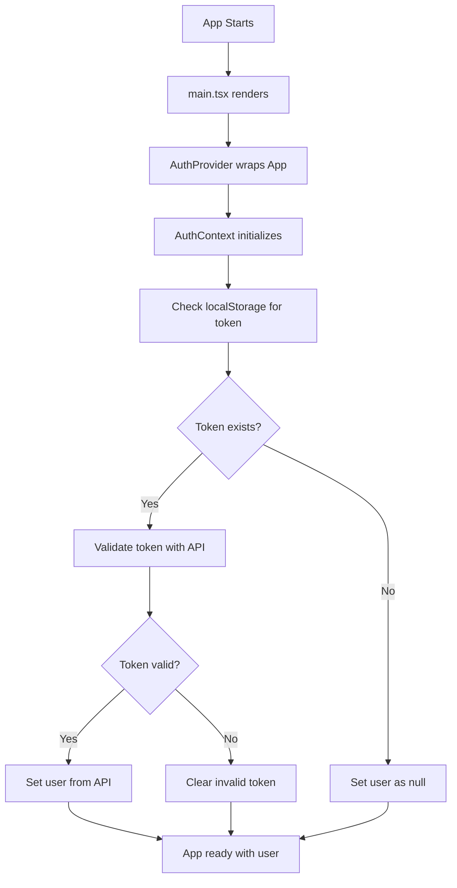
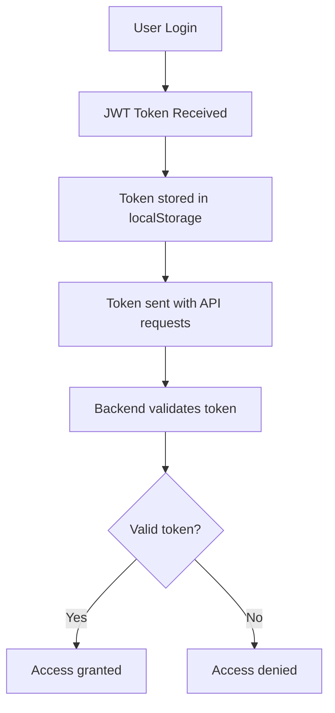

# 🔐 Authentication System File Flow Diagram

## 📋 Overview

This document explains the file flow and architecture of the authentication system in the frontend application, focusing on three key files:

- **`api.ts`** - Core API layer with authentication endpoints
- **`auth.ts`** - Authentication utilities and state management
- **`useAuth.tsx`** - React hook for authentication context

## 🏗️ System Architecture

```
┌─────────────────────────────────────────────────────────────────────────┐
│                          React Application                              │
├─────────────────────────────────────────────────────────────────────────┤
│  ┌─────────────┐  ┌─────────────┐  ┌─────────────┐  ┌─────────────┐     │
│  │  App.tsx    │  │  Login.tsx  │  │Dashboard.tsx│  │ Pages/...   │     │
│  │             │  │             │  │             │  │             │     │
│  └──────┬──────┘  └──────┬──────┘  └──────┬──────┘  └──────┬──────┘     │
│         │               │               │               │         │
│         └───────────────┼───────────────┼───────────────┼─────────┘
│                         │               │               │
│              ┌──────────▼──────────┐    │               │
│              │   useAuth.tsx       │    │               │
│              │ (React Hook)        │    │               │
│              └──────────┬──────────┘    │               │
│                         │               │               │
│              ┌──────────▼──────────┐    │               │
│              │   auth.tsx          │    │               │
│              │ (React Context)     │    │               │
│              └──────────┬──────────┘    │               │
│                         │               │               │
│              ┌──────────▼──────────┐    │               │
│              │   api.ts            │    │               │
│              │ (API Layer)         │    │               │
│              └──────────┬──────────┘    │               │
│                         │               │               │
│              ┌──────────▼──────────┐    │               │
│              │   Backend API       │    │               │
│              │   (External)        │    │               │
│              └─────────────────────┘    │               │
└─────────────────────────────────────────────────────────────────────────┘
```

## 📁 File Dependencies

### **api.ts** (Core API Layer)
```typescript
// Exports: Types, API functions, utilities
export interface User { ... }
export interface AuthResponse { ... }
export const authApi = { login, register, getProfile, logout }
export const eventsApi = { getAll, create, update, delete }
export const filesApi = { upload, download, delete }
```

**Dependencies:**
- None (base layer)

**Key Functions:**
- `apiRequest<T>()` - Generic API request handler
- `authApi.googleLogin()` - OAuth login
- `authApi.login()` - Password authentication
- `authApi.getProfile()` - Get user data

### **auth.ts** (Authentication Utilities)
```typescript
// Exports: Token management, session management, helpers
export const tokenManager = { setToken, getToken, removeToken }
export const sessionManager = { setUser, getUser, clearSession }
export const authHelpers = { handleLoginSuccess, handleLogout }
export const routeProtection = { requireAuth, requireAdmin }
```

**Dependencies:**
- `api.ts` - Uses User and AuthResponse types

**Key Functions:**
- `tokenManager.getToken()` - Retrieve JWT from localStorage
- `sessionManager.isLoggedIn()` - Check authentication status
- `authHelpers.handleLoginSuccess()` - Process successful login
- `routeProtection.requireAuth()` - Protect routes

### **useAuth.tsx** (React Hook)
```typescript
// Exports: useAuth hook
export const useAuth = () => {
  const context = useContext(AuthContext);
  return { user, login, logout, isAuthenticated, ... }
}
```

**Dependencies:**
- `auth.tsx` - Uses AuthContext
- `api.ts` - Uses User and AuthResponse types

**Key Functions:**
- `login()` - Handle user login
- `logout()` - Handle user logout
- `isAuthenticated` - Computed authentication state

## 🔄 Data Flow

### **Authentication Flow**

```
┌─────────────┐    ┌─────────────┐    ┌─────────────┐    ┌─────────────┐
│   Login     │───▶│  useAuth    │───▶│   auth.ts   │───▶│   api.ts    │
│   Page      │    │   Hook      │    │ Utilities   │    │   Layer     │
└─────────────┘    └─────────────┘    └─────────────┘    └─────────────┘
       │                   │                   │                   │
       ▼                   ▼                   ▼                   ▼
┌─────────────┐    ┌─────────────┐    ┌─────────────┐    ┌─────────────┐
│User enters  │    │Context      │    │Token        │    │HTTP         │
│credentials  │    │updated      │    │management   │    │request to   │
│             │    │             │    │             │    │backend      │
└─────────────┘    └─────────────┘    └─────────────┘    └─────────────┘
```

### **Detailed Flow Steps**

1. **User Login Process:**
   ```
   Login.tsx → useAuth.login()
     ↓
   auth.tsx → authHelpers.handleLoginSuccess()
     ↓
   auth.ts → tokenManager.setToken()
     ↓
   api.ts → authApi.login() → Backend
   ```

2. **Token Validation:**
   ```
   ProtectedRoute → useAuth.isAuthenticated
     ↓
   auth.tsx → sessionManager.isLoggedIn()
     ↓
   auth.ts → tokenManager.isTokenExpired()
   ```

3. **Logout Process:**
   ```
   Header → useAuth.logout()
     ↓
   auth.tsx → authHelpers.handleLogout()
     ↓
   auth.ts → sessionManager.clearSession()
     ↓
   Redirect to /login
   ```

## 🔧 Component Interactions

### **useAuth Hook Usage**
```typescript
// In any React component
import { useAuth } from '../lib/useAuth';

function MyComponent() {
  const {
    user,           // Current user object
    isAuthenticated, // Boolean auth status
    isLoading,      // Loading state
    login,          // Login function
    logout,         // Logout function
    error,          // Error state
  } = useAuth();

  // Component logic here
}
```

### **API Integration**
```typescript
// Using API functions directly
import { authApi, eventsApi } from '../lib/api';

async function handleLogin(email, password) {
  const response = await authApi.login(email, password);
  if (response.data) {
    // Handle successful login
  }
}
```

### **Route Protection**
```typescript
// In App.tsx
import { routeProtection } from '../lib/auth';

function ProtectedRoute({ children }) {
  const isAllowed = routeProtection.requireAuth();
  return isAllowed ? children : <Navigate to="/login" />;
}
```

## 📊 State Management

### **Global State (React Context)**
```typescript
// auth.tsx - AuthContext
interface AuthContextType {
  user: User | null;
  isLoading: boolean;
  isAuthenticated: boolean;
  login: (email: string, password: string) => Promise<void>;
  logout: () => void;
  error: string | null;
  clearError: () => void;
}
```

### **Local State (localStorage)**
```typescript
// auth.ts - Token Management
localStorage.setItem('auth_token', token);
localStorage.setItem('user_data', JSON.stringify(user));

// Session Management
localStorage.getItem('auth_token');
localStorage.getItem('user_data');
```

## 🔍 Error Handling Flow

```
┌─────────────┐    ┌─────────────┐    ┌─────────────┐    ┌─────────────┐
│ API Request │───▶│ API Error   │───▶│ Context     │───▶│ UI Error    │
│   Fails     │    │ Handling    │    │ Error State │    │ Display     │
└─────────────┘    └─────────────┘    └─────────────┘    └─────────────┘
       │                   │                   │                   │
       ▼                   ▼                   ▼                   ▼
┌─────────────┐    ┌─────────────┐    ┌─────────────┐    ┌─────────────┐
│Network/HTTP │    │Error message│    │error =      │    │Error        │
│Error        │    │formatted    │    │"Login       │    │component    │
│             │    │             │    │failed"      │    │renders      │
└─────────────┘    └─────────────┘    └─────────────┘    └─────────────┘
```

## 🚀 Initialization Flow

### **Application Startup**


## 📈 Performance Considerations

### **Optimization Strategies**
1. **Lazy Loading**: Authentication context only loads when needed
2. **Token Caching**: JWT stored in localStorage to avoid repeated API calls
3. **Memoization**: React.memo and useMemo for expensive operations
4. **Error Boundaries**: Catch and handle authentication errors gracefully

### **Memory Management**
- Context providers are lightweight
- localStorage operations are synchronous
- API calls are async with proper cleanup

## 🔒 Security Considerations

### **Security Flow**


### **Security Measures**
- JWT tokens stored securely in localStorage
- Automatic token expiration checking
- Secure API request headers
- Route protection at component level

## 🎯 Usage Examples

### **Basic Authentication Check**
```typescript
import { useAuth } from '../lib/useAuth';

function Dashboard() {
  const { user, isAuthenticated, logout } = useAuth();

  if (!isAuthenticated) {
    return <div>Please log in</div>;
  }

  return (
    <div>
      <h1>Welcome, {user.name}!</h1>
      <button onClick={logout}>Logout</button>
    </div>
  );
}
```

### **API Call with Authentication**
```typescript
import { eventsApi } from '../lib/api';
import { useAuth } from '../lib/useAuth';

function EventList() {
  const { isAuthenticated } = useAuth();

  const fetchEvents = async () => {
    if (!isAuthenticated) return;

    const response = await eventsApi.getAll();
    if (response.data) {
      // Handle events data
    }
  };

  // Component JSX
}
```

## 📝 Summary

The authentication system follows a clean, layered architecture:

1. **API Layer** (`api.ts`) - Handles all backend communication
2. **Utility Layer** (`auth.ts`) - Manages tokens and session state
3. **React Layer** (`useAuth.tsx` + `auth.tsx`) - Provides React context and hooks

This separation allows for:
- ✅ Easy testing of individual layers
- ✅ Reusable authentication logic
- ✅ Clean component interfaces
- ✅ Scalable architecture
- ✅ Type safety throughout

The system is designed to be robust, secure, and maintainable while providing a smooth user experience.